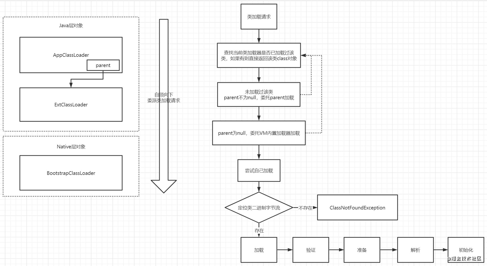

## 浅析Java虚拟机

### JVM运行时的5个数据区域
先上一张`《深入理解Java虚拟机》`的JVM运行时数据区划分图:

在书中的第二章对Java虚拟机的自动内存管理做了详细的介绍，一般来说，Java程序员关注的主要为三个区：`方法区`,`虚拟机栈`,`堆`
下面对各个区再用自己的理解，简单的浅析一遍

- 方法区：`类信息`，`常量`，`静态变量`，`即时编译器编译的代码（热更新的类）`
- 虚拟机栈：控制方法执行顺序，每个`栈帧`主要存`局部变量表`，`操作栈`，`动态链接`，`方法出口`等信息
- 堆：存`对象实例`，`新生代`，`老年代`。默认大小比例`1：2`。新生代分为`Eden（伊甸区）`和 `Survivor（幸存区：幸存区又分为From和To两个区）`, 默认的大小比例为 `8:1:1`。`元空间`为直接内存
- 本地方法栈：跟虚拟机栈类似，只不过为native方法提供服务
- 程序计数器（PC寄存器）：存储指令地址，控制指令执行顺序
- 运行时常量池：方法区的一部分，存储`字面量`和`符号引用`[(字面量和符号引用的解释)](https://blog.csdn.net/qq_38006520/article/details/83796450)可运行时动态添加变量如`String的intern()`方法


### 对象的创建，类加载和对象访问
#### 对象的创建方式
```java
Object object = new Object();
```
上面这段代码，是Java创建对象的一种基本方法，Java创建对象的方法大体有以下四种:

1. `new`关键字
2. `clone`对象克隆
3. 反序列化
4. 利用反射newInstance

#### 对象的创建过程（new以后发生了什么）
对象的创建过程大概上可以分为以下5步：

1. 判断类是否加载
   - 类加载又分为：`加载`、`连接`（验证，准备，解析）、`初始化`（类构造器init方法）、`使用`、`卸载`几个步骤
    - 类加载的机制一般是`双亲委派机制`
    - 类加载器主要分为四类：启动类（Bootstrap）、扩展（Ext）、应用(App或者叫系统类加载器)、自定义（Custom）
2. 对象分配内存（主要指堆）
   - 内存分配方式：指针碰撞（内存规整）/ 空闲列表（不规整）
   - 并发、线程安全：同步: CAS+失败重试 / TLAB:设置参数`-XX:UseTLAB`
   - 分配步骤：先尝试栈分配，再尝试TLAB，最后堆上面大对象old否则eden
3. 初始化分配到的内存空间
4. 对象头设置,如类型指针和MarkWord
5. 执行对象的init初始化方法，一般来说是构造方法

#### 类加载和双亲委派
类加载在上面已经提到过，上一张图，不再赘述


##### 双亲委派机制
双亲委派机制简单的说就是类的加载会`自底向上找到最顶层的类加载，如果不能加载再由顶向下一层层加载`最后没由加载就会抛出`ClassNotFoundException`。双亲委派机制的目的是保证类的信息唯一



#### 对象的访问
对像的访问有两种: `句柄访问`和`直接指针`如下面两张图

句柄访问的好处是栈里只用存句柄地址，对象指针改变，栈句柄不用改。但是需要先访问到句柄，再通过句柄访问到对象实例


直接指针的好处是只访问一次，直接访问到对象实例，劣势是对象指针改变，栈存的引用指针跟着改变

### JVM相关命令行参数
JVM的参数其实就是对JVM各个区域的参数配置，不同区域有不同的参数配置，以及对于GC的一些分析，常用的主要有：

- -Xmx：堆最小值
- -Xms: 堆最大值
- -Xmn: 年轻代大小
- -XX:SurvivorRatio：Eden区和Survivor的比例
- -XX:MaxTenuringThreshold：垃圾最大年龄

其他的一些可以从其他博客查看:
[JVM常用命令](https://www.cnblogs.com/redcreen/archive/2011/05/04/2037057.html)

### 其他问题
1. 频繁发生Full GC，可以怎么解决？
2. 内存溢出和内存泄漏有什么区别？
3. 双亲委派机制的目的和好处，如何破坏双亲委派机制

### 其他博客链接
[JVM系列](https://www.cnblogs.com/ityouknow/p/5603287.html)

### 总结
浅析了一遍我所了解的Java虚拟机，也可以说《深入理解Java虚拟机》的读后感。对Java虚拟机有了一个大概的了解，应付浅一点的面试应该是足够了。再深入的就只有后续遇到或者感兴趣的时候再研究了

> 写于2020年12月14号21:42  成都